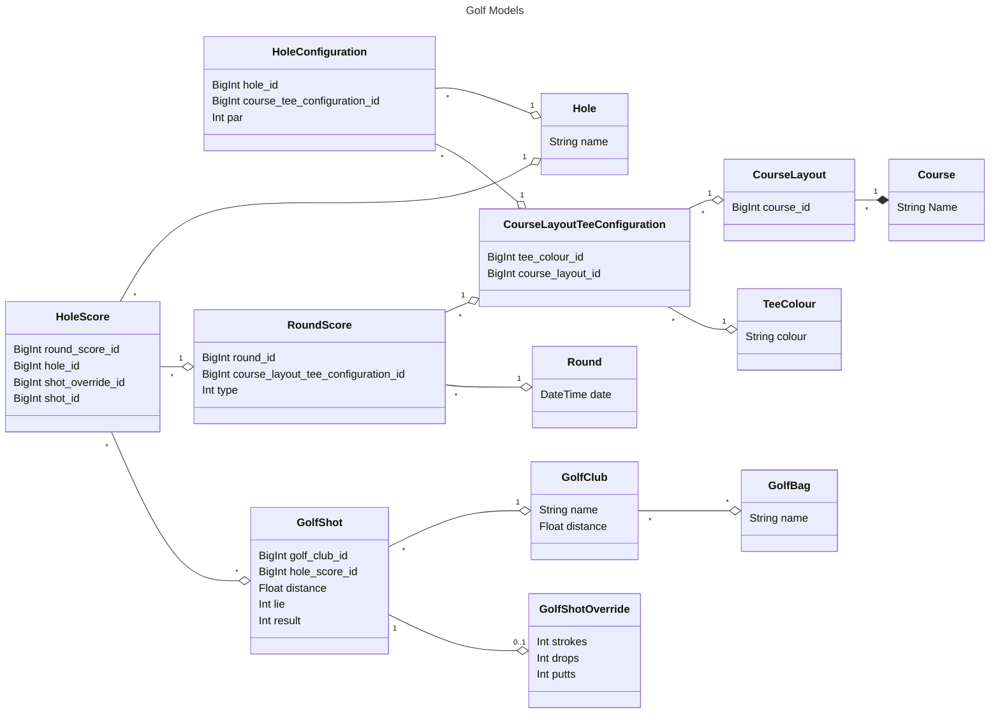

```mermaid
---
title: Golf Models
---
classDiagram
  direction LR

  class Round {
    DateTime date
  }

  class Course {
    String Name
  }

  class Hole {
    String name
  }

  class HoleConfiguration {
    BigInt hole_id
    BigInt course_tee_configuration_id
    Int par
  }

  class CourseLayout {
    BigInt course_id
  }

  class CourseLayoutTeeConfiguration {
    BigInt tee_colour_id
    BigInt course_layout_id
  }

  class HoleScore {
    BigInt round_score_id
    BigInt hole_id
    BigInt shot_override_id
    BigInt shot_id
  }

  class RoundScore {
    BigInt round_id
    BigInt course_layout_tee_configuration_id
    Int type
  }

  class TeeColour {
    String colour
  }

  class GolfShot {
    BigInt golf_club_id
    BigInt hole_score_id
    Float distance
    Int lie
    Int result
  }

  class GolfShotOverride {
    Int strokes
    Int drops
    Int putts
  }

  class GolfBag {
    String name
  }

  class GolfClub {
    String name
    Float distance
  }

  CourseLayout "*" --* "1" Course

  RoundScore "*" --o "1" CourseLayoutTeeConfiguration

  HoleScore "*" --o "1" Hole
  HoleConfiguration "*" --o "1" Hole
  HoleConfiguration "*" --o "1" CourseLayoutTeeConfiguration

  CourseLayoutTeeConfiguration "*" --o "1" CourseLayout
  CourseLayoutTeeConfiguration "*" --o "1" TeeColour

  HoleScore "*" --o "1" RoundScore

  RoundScore "*" --o "1" Round

  GolfClub "*" --o "*" GolfBag
  GolfShot "*" --o "1" GolfClub

  HoleScore "*" --o "*" GolfShot
  GolfShot "1" --o "0..1" GolfShotOverride

```
