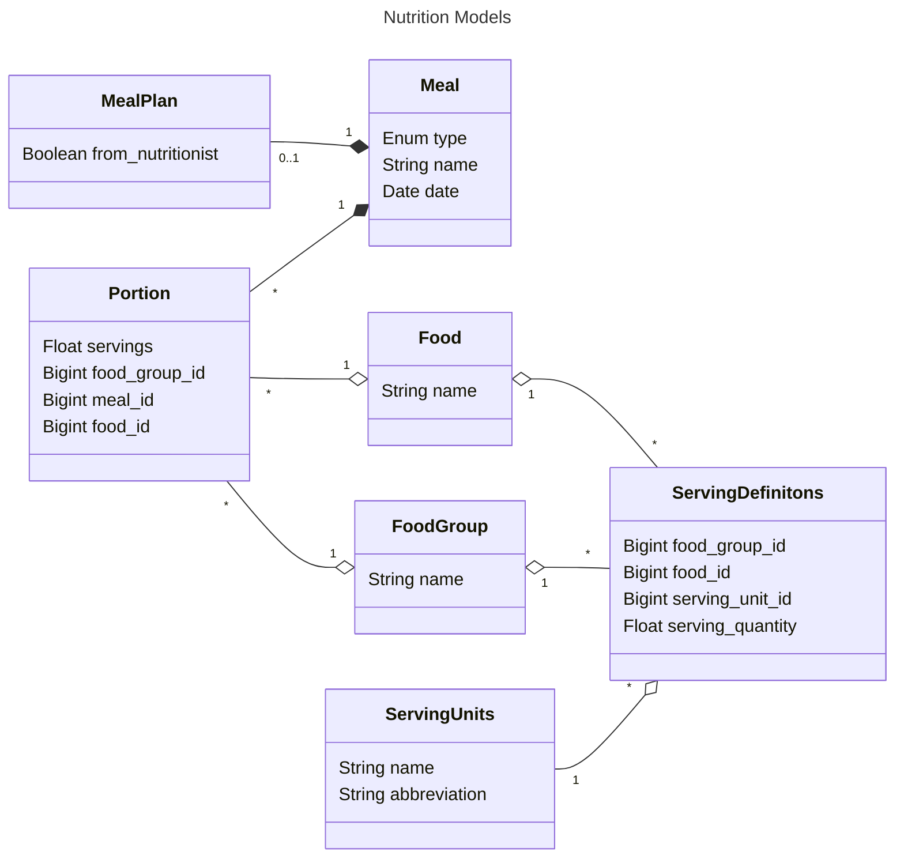

# Nutrition Models

```mermaid
---
title: Nutrition Models
---
classDiagram
    direction LR
    class MealPlan {
        Boolean from_nutritionist
    }

    class Meal {
        Enum type
        String name
        Date date
    }

    class FoodGroup {
        String name
    }

    class Food {
        String name
    }

    class Portion {
        Float servings
        Bigint food_group_id
        Bigint meal_id
        Bigint food_id
    }

    class ServingDefinitons {
        Bigint food_group_id
        Bigint food_id
        Bigint serving_unit_id
        Float serving_quantity
    }

    class ServingUnits {
        String name
        String abbreviation
    }

    MealPlan "0..1" --* "1" Meal

    Portion "*" --* "1" Meal
    Portion "*" --o "1" FoodGroup
    Portion "*" --o "1" Food
    Food "1" o-- "*" ServingDefinitons
    FoodGroup "1" o-- "*" ServingDefinitons
    ServingUnits "1" --o "*" ServingDefinitons
```
