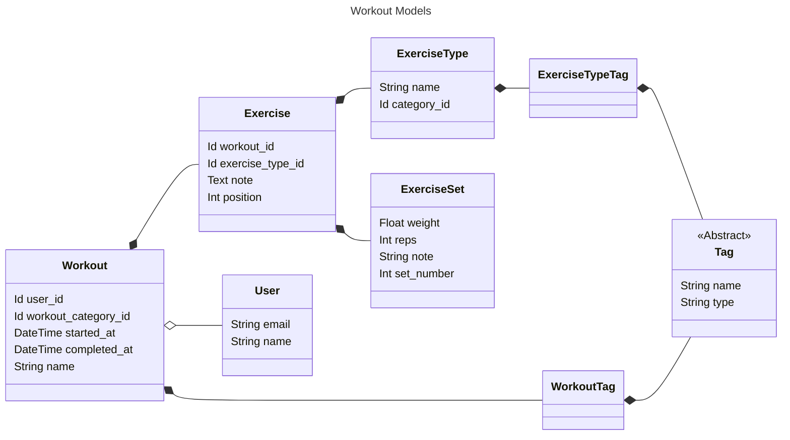

```mermaid
---
title: Workout Models
---
classDiagram
  direction LR

  class ExerciseType {
    String name
    Id category_id
  }

  class Tag {
    <<Abstract>>
    String name
    String type
  }

  class ExerciseTypeTag

  class WorkoutTag

  class Workout {
    Id user_id
    Id workout_category_id
    DateTime started_at
    DateTime completed_at
    String name
  }

  class Exercise {
    Id workout_id
    Id exercise_type_id
    Text note
    Int position
  }

  class ExerciseSet {
    Float weight
    Int reps
    String note
    Int set_number
  }

  class User {
    String email
    String name
  }

  Workout o-- User
  Exercise *-- ExerciseSet
  Workout *-- Exercise
  Exercise *-- ExerciseType
  ExerciseType *-- ExerciseTypeTag
  Workout *-- WorkoutTag
  ExerciseTypeTag *-- Tag
  WorkoutTag *-- Tag

```
